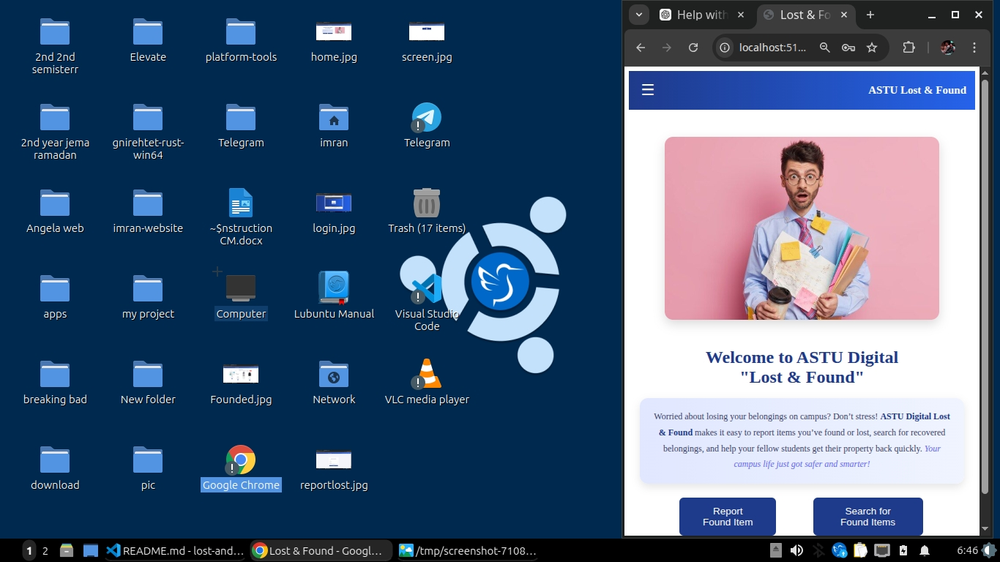
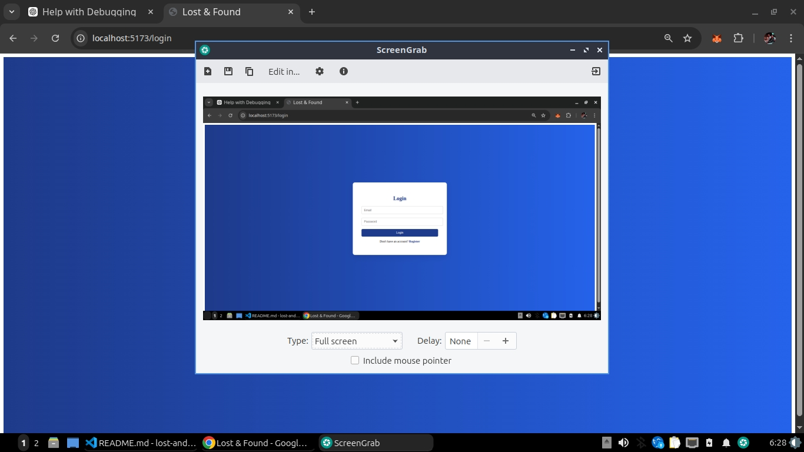
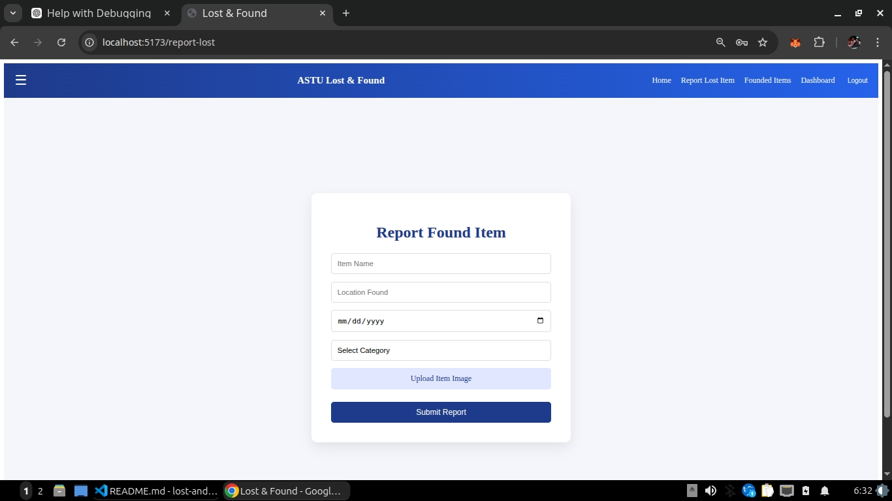
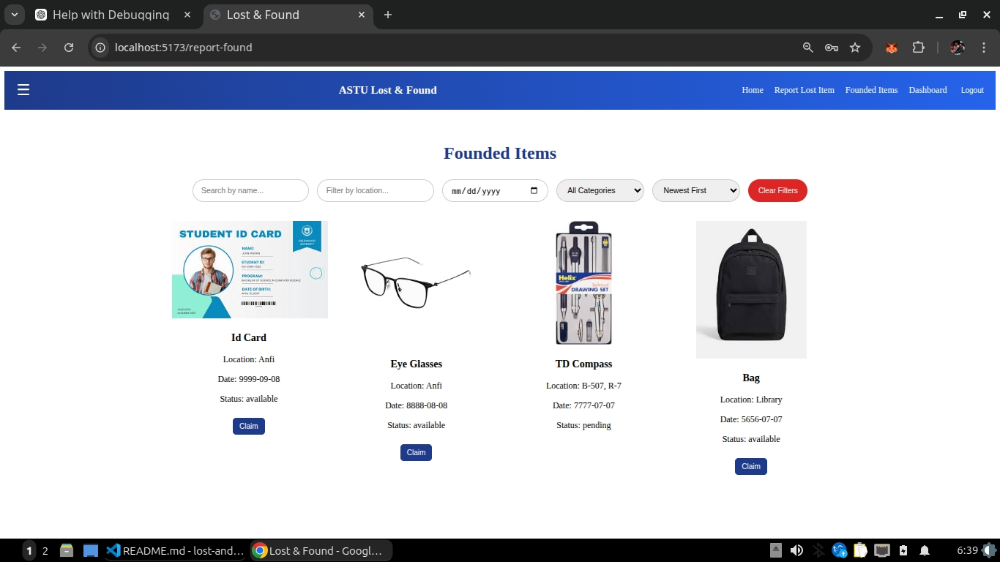

# ASTU Digital Lost & Found

A campus-based lost and found web application built with **React** and **Vite**, helping students report, track, and retrieve lost items easily.  
Now includes **user authentication, dashboards, and separate pages for reporting lost and found items**.

---

## 🚀 Features

- **User Authentication**: Login and register with protected routes.  
- **Report Lost Items**: Submit lost items with name, location, date, and optional image.  
- **Report Found Items**: Submit found items with name, location, date, and image.  
- **View Submitted Items**: All reported items displayed on the dashboard for quick access.  
- **Dashboard Overview**: Shows statistics for lost and found items.  
- **Search Functionality**: Search items by name or category directly from the dashboard.  
- **Responsive UI**: Works seamlessly on mobile, tablet, and desktop.  
- **Interactive Navbar**: Hamburger menu for mobile, fully responsive and collapsible.  

---

## 📸 Screenshots

### 🏠 Home Page


### 📝 Sidebar (Mobile Version)


### 🔑 Login Page


### ✍️ Report Lost Item Page


### 📝 Founded Items Page


### 📊 Dashboard


---

## 🛠️ Technologies Used

- ⚛️ **React** – Component-based UI library  
- ⚡ **Vite** – Fast development server and build tool  
- 🎨 **CSS** – Responsive layout and styling  

---

## 🌟 Future Improvements

- **Admin Approval for Items**: Admin review for newly reported lost/found items.  
- **User Profile Management**: Users can edit account info and track their submissions.  
- **Notifications / Alerts**: Inform users when items are retrieved or claimed.  

---

## 💻 Installation & Usage

1. **Clone the repository**:

```bash
git clone https://github.com/babaty73/lost-and-found.git


2 Navigate to the project directory:

cd lost-and-found


3 Install dependencies:

npm install


4 Start the development server:

npm run dev


Open in browser:
Visit http://localhost:5173 (or the port shown in terminal).