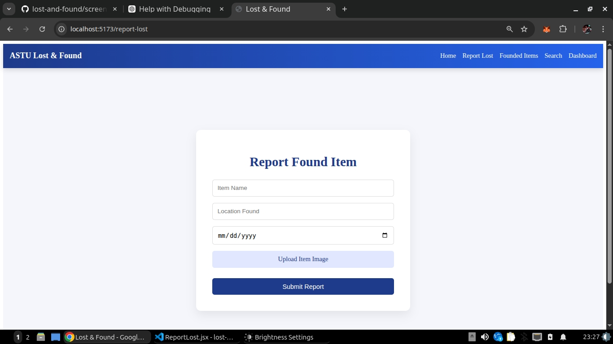

# ASTU Digital Lost & Found

A campus-based lost and found web application built with React and Vite.

## 🚀 Features
- Report found items
- View submitted items
- Dashboard overview
- Responsive UI

## 📸 Screenshots

### 🏠 Home Page

### 📝 Report Item

### 📊 Dashboard

## Usage
1. Run `npm install`
2. Run `npm run dev` to start the local server
