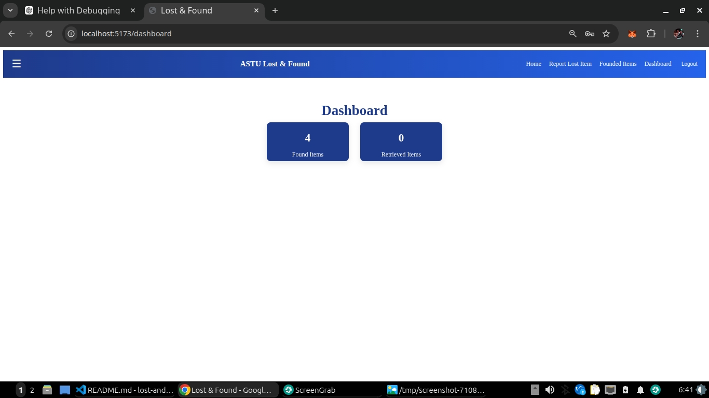

# ASTU Digital Lost & Found

A web app to report and track lost and found items on campus.

## Features
- Report found items with name, founded location, date, and image
- View all reported items in a clean dashboard
- Responsive design

## Screenshots
### Home Page

### Dashboard

## Usage
1. Run `npm install`
2. Run `npm run dev` to start the local server
